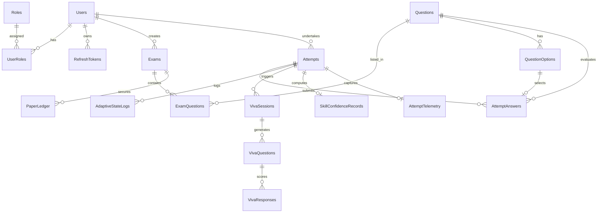
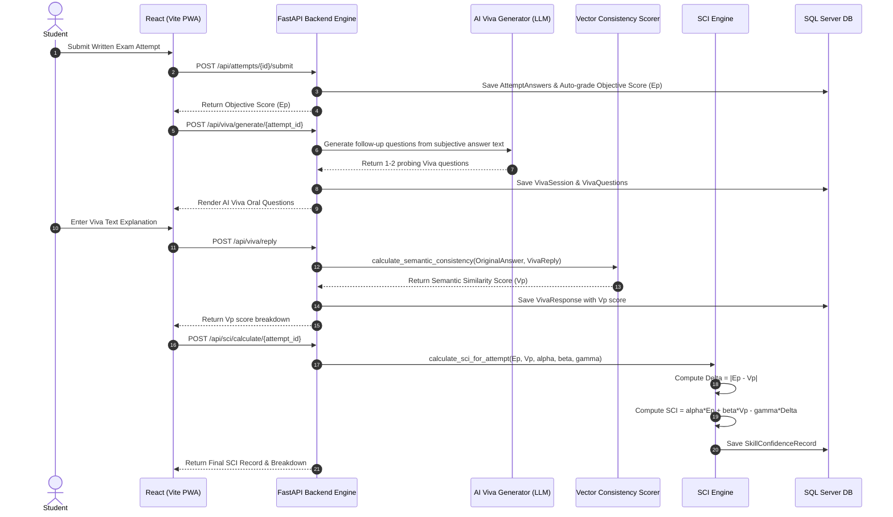

# Mindscribe — System Architecture & Flow Diagrams

## 1. Entity Relationship (ER) Diagram

```mermaid
erDiagram
    Users ||--o{ UserRoles : has
    Roles ||--o{ UserRoles : assigned
    Users ||--o{ RefreshTokens : owns
    Users ||--o{ Exams : creates
    Users ||--o{ Attempts : undertakes
    
    Exams ||--o{ ExamQuestions : contains
    Questions ||--o{ ExamQuestions : listed_in
    Questions ||--o{ QuestionOptions : has
    
    Attempts ||--o{ AttemptAnswers : submits
    Questions ||--o{ AttemptAnswers : evaluates
    QuestionOptions ||--o| AttemptAnswers : selects
    
    Attempts ||--o{ AdaptiveStateLogs : logs
    Attempts ||--o{ VivaSessions : triggers
    
    VivaSessions ||--o{ VivaQuestions : generates
    VivaQuestions ||--o{ VivaResponses : scores
    
    Attempts ||--o| SkillConfidenceRecords : computes
    Attempts ||--o| AttemptTelemetry : captures
    Exams ||--o{ PaperLedger : secures
```

---

## 2. Sequence Diagram: Exam Submission → AI Viva → SCI Calculation

```mermaid
sequenceDiagram
    autonumber
    actor Student
    participant Frontend as React (Vite PWA)
    participant API as FastAPI Backend Engine
    participant LLM as AI Viva Generator (LLM)
    participant Scorer as Vector Consistency Scorer
    participant SCI as SCI Engine
    participant DB as SQL Server DB

    Student->>Frontend: Submit Written Exam Attempt
    Frontend->>API: POST /api/attempts/{id}/submit
    API->>DB: Save AttemptAnswers & Auto-grade Objective Score (Ep)
    API-->>Frontend: Return Objective Score (Ep)

    Frontend->>API: POST /api/viva/generate/{attempt_id}
    API->>LLM: Generate follow-up questions from subjective answer text
    LLM-->>API: Return 1-2 probing Viva questions
    API->>DB: Save VivaSession & VivaQuestions
    API-->>Frontend: Render AI Viva Oral Questions

    Student->>Frontend: Enter Viva Text Explanation
    Frontend->>API: POST /api/viva/reply
    API->>Scorer: calculate_semantic_consistency(OriginalAnswer, VivaReply)
    Scorer-->>API: Return Semantic Similarity Score (Vp)
    API->>DB: Save VivaResponse with Vp score
    API-->>Frontend: Return Vp score breakdown

    Frontend->>API: POST /api/sci/calculate/{attempt_id}
    API->>SCI: calculate_sci_for_attempt(Ep, Vp, alpha, beta, gamma)
    SCI->>SCI: Compute Delta = |Ep - Vp|
    SCI->>SCI: Compute SCI = alpha*Ep + beta*Vp - gamma*Delta
    SCI->>DB: Save SkillConfidenceRecord
    API-->>Frontend: Return Final SCI Record & Breakdown
```
